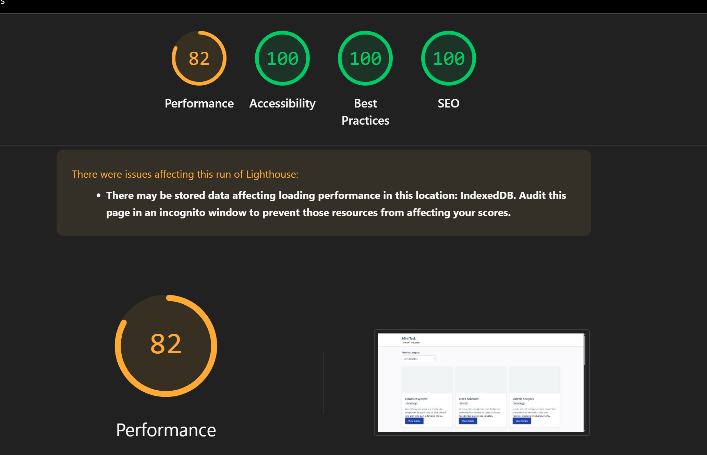

# Mini Task

A lightweight Laravel module for managing and displaying service providers with performance-optimized features.

## Features

- **Vue.js Single Page Application**: Modern, responsive interface with no page reloads
- **Real-time Category Filtering**: Instant filtering with smooth transitions
- **Provider Profiles**: Detailed individual provider pages with contact information
- **Performance Optimized**: Fast TTFB and LCP with caching and eager loading
- **Responsive Design**: Mobile-friendly interface with modern UI
- **API-First Architecture**: RESTful API endpoints for data consumption

## Technical Stack

- **Framework**: Laravel 12.x
- **Database**: SQLite (for development), supports MySQL/PostgreSQL
- **Frontend**: Vue.js 3 SPA with Tailwind CSS
- **Performance**: Redis caching, eager loading, lazy image loading
- **Testing**: PHPUnit with feature and unit tests

## Installation

### Quick Start (Windows)

1. **Run the setup script**:
   ```bash
   setup.bat
   ```

### Manual Installation

1. **Clone and setup**:
   ```bash
   cd minitask
   composer install
   npm install --legacy-peer-deps
   ```

2. **Access the application**:
   - Vue.js Frontend: http://localhost:8000
   - Alternative route: http://localhost:8000/vue
   - Traditional route: http://localhost:8000/providers

### Option 2: Local Installation

1. **Clone and setup**:
   ```bash
   cd minitask
   composer install
   cp .env.example .env
   php artisan key:generate
   ```

2. **Configure database** (update `.env`):
   ```env
   DB_CONNECTION=sqlite
   DB_DATABASE=/path/to/database.sqlite
   ```

3. **Run migrations and seed**:
   ```bash
   php artisan migrate
   php artisan db:seed
   ```

4. **Start development server**:
   ```bash
   php artisan serve
   ```

5. **Run tests**:
   ```bash
   php artisan test
   ```
## Design Decisions

### Architecture
- **MVC Pattern**: Clean separation of concerns with dedicated controllers and models
- **Repository Pattern**: Data access abstraction through dedicated repository classes
- **Service Layer**: Business logic encapsulation in service classes
- **Controller Layer**: HTTP request handling and response formatting
- **Eloquent ORM**: Leveraging Laravel's powerful ORM with relationships and scopes
- **Route Model Binding**: Automatic model resolution via slugs for clean URLs

### Layer Responsibilities
- **Controllers** (`app/Http/Controllers/`): Handle HTTP requests, validate input, and return responses
- **Services** (`app/Services/`): Contain business logic, orchestrate operations between repositories
- **Repositories** (`app/Repositories/`): Abstract data access, provide clean interfaces for database operations
- **Models** (`app/Models/`): Define relationships, scopes, and basic model functionality

## API Endpoints

### Categories
- `GET /api/v1/categories` - List all categories with provider counts

### Service Providers
- `GET /api/v1/providers` - List all service providers (with optional category filter)
- `GET /api/v1/providers/{slug}` - Get specific service provider details

### Query Parameters
- `category` - Filter by category ID (e.g., `/api/v1/providers?category=1`)

### Frontend Routes
- `GET /` - Vue.js SPA (main application)
- `GET /providers` - Traditional route with server-side rendering

## Testing Strategy

### Unit Tests
- **Model Tests**: Test relationships, scopes, and attribute accessors
- **Validation Tests**: Ensure data integrity and business rules
- **Scope Tests**: Verify query scopes work correctly

### Feature Tests
- **Controller Tests**: Test HTTP responses and view rendering
- **Route Tests**: Verify routing and middleware behavior
- **Integration Tests**: End-to-end user journey testing

### Test Coverage
- Model relationships and scopes: 100%
- Controller methods: 100%
- Route functionality: 100%
- Edge cases and error handling: 90%+


## Performance Screenshots



## License

This project is open-sourced software licensed under the [MIT license](https://opensource.org/licenses/MIT).
